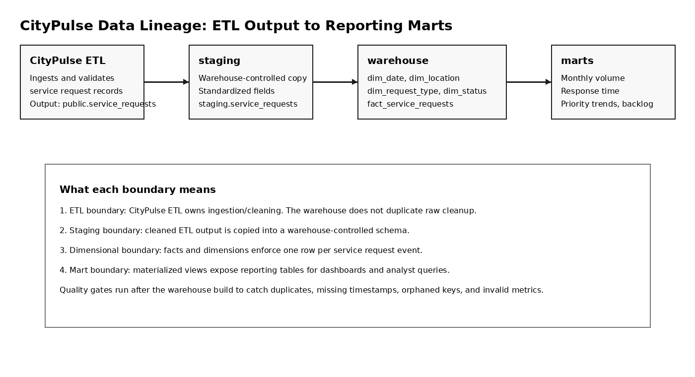
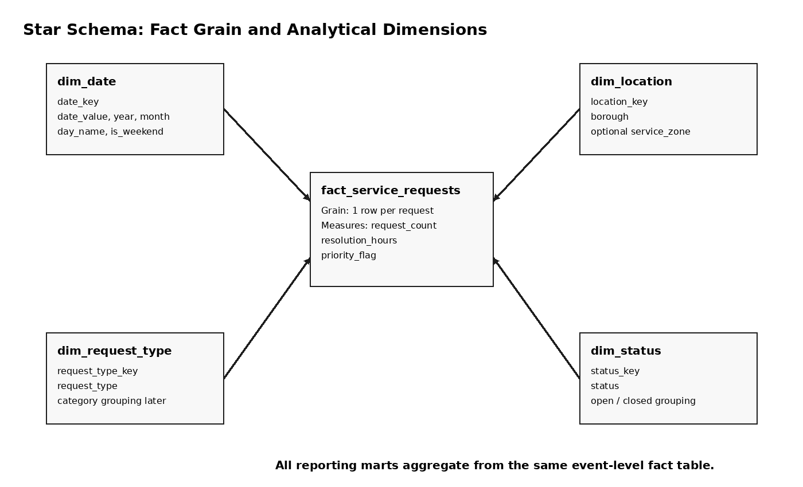
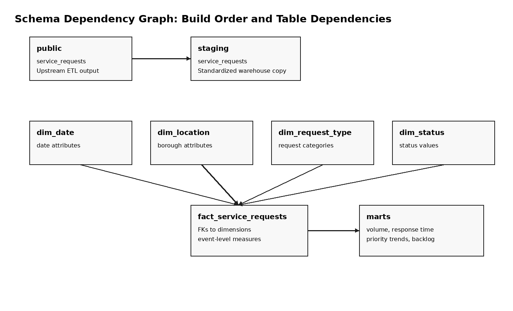
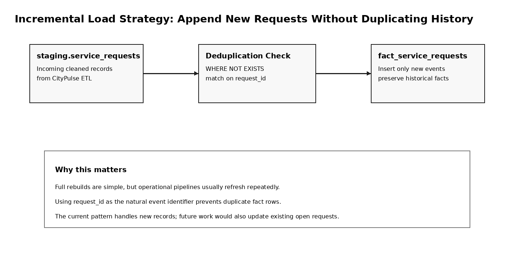
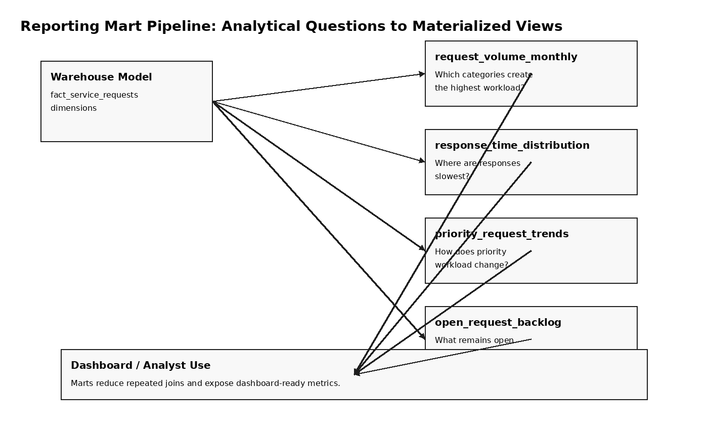

# CityPulse Analytics Warehouse

CityPulse Analytics Warehouse is a PostgreSQL dimensional warehouse that extends the CityPulse ETL pipeline. The ETL project prepares cleaned municipal service request records; this warehouse turns those records into fact tables, dimensions, quality checks, and reporting marts that answer operational analytics questions.

The project is intentionally scoped as a serious capstone-style analytics engineering system. It is not a generic “enterprise” warehouse. It focuses on one clearly defined domain: civic service request operations.

## Analytical Questions

The warehouse is designed to answer questions such as:

- Which service categories create the highest monthly workload?
- Which boroughs or locations have the longest resolution times?
- How many open, closed, and escalated requests exist by month?
- Which request types show seasonal spikes?
- How do priority requests compare to standard requests over time?
- Which reporting marts would be useful for a public operations dashboard?

## System Boundary

This repository starts where the CityPulse ETL pipeline ends.

CityPulse ETL is responsible for ingestion, cleaning, and validation. This repository assumes the ETL has loaded cleaned records into PostgreSQL as:

```sql
public.service_requests
```

This warehouse then builds:

```text
staging.service_requests
warehouse.dim_date
warehouse.dim_location
warehouse.dim_request_type
warehouse.dim_status
warehouse.fact_service_requests
marts.request_volume_monthly
marts.response_time_distribution
marts.priority_request_trends
marts.open_request_backlog
```

## Lineage Overview



The lineage diagram shows the actual boundary between the upstream CityPulse ETL pipeline and this warehouse. The warehouse does not scrape or clean raw records. It imports cleaned ETL output, standardizes it into staging, builds dimensions and facts, and exposes reporting marts.

## Star Schema and Grain



The fact table grain is:

> one row per service request event

This matters because every metric in the reporting layer depends on that grain. Request counts, backlog counts, average resolution time, and priority trends all aggregate from the same event-level fact table.

## Schema Dependency Graph



The dependency graph shows how dimensions feed the fact table and how marts depend on both the fact table and dimensions. This is more useful than a generic architecture diagram because it explains which tables must be built first.

## Incremental Load Strategy



The warehouse includes an append-safe incremental loading pattern. Existing request IDs are not reinserted into the fact table, which allows repeated refreshes without duplicating historical events.

## Reporting Mart Pipeline



The marts are organized around operational questions: volume, backlog, response time, and priority workload. They are designed to support dashboards or analyst queries without requiring users to join the full dimensional model manually.

## Repository Structure

```text
CityPulse-Analytics-Warehouse/
├── assets/                         # Meaningful diagrams and schema visuals
├── docs/                           # Explanation, lineage, grain, and interview notes
├── scripts/                        # Build scripts and sample data utilities
├── sql/
│   ├── integration/                # Imports CityPulse ETL output into staging
│   ├── staging/                    # Staging schema setup
│   ├── warehouse/                  # Dimensions, fact table, constraints, SCD2 example
│   ├── incremental/                # Incremental fact load pattern
│   ├── marts/                      # Reporting marts and materialized views
│   ├── quality/                    # Data quality checks
│   └── analytics/                  # Example analyst queries
├── docker-compose.yml
└── README.md
```

## How to Run

Start PostgreSQL:

```powershell
docker compose up -d
```

Run the integrated warehouse build after CityPulse ETL has loaded `public.service_requests`:

```powershell
scripts\run_full_lineage_build.ps1
```

Or run directly with psql:

```powershell
psql -h localhost -U citypulse -d citypulse -f sql/run_citypulse_integrated_build.sql
```

## Build Order

The integrated build follows this order:

```text
1. Create staging schema
2. Import cleaned CityPulse ETL records from public.service_requests
3. Create warehouse dimensions
4. Create fact_service_requests
5. Add constraints
6. Run incremental fact load example
7. Create reporting marts
8. Run data quality checks
```

## Warehouse Design Decisions

- The warehouse uses a star schema because the main analytical need is aggregation by date, location, request type, and status.
- Staging exists to isolate ETL output from warehouse logic.
- The fact table stores event-level service request records.
- Reporting marts are materialized views to make repeated analytics queries simpler.
- Incremental loading is demonstrated with request-level duplicate protection.
- SCD Type 2 logic is included as an example for tracking changes in location attributes over time.

## Key SQL Artifacts

| File | Purpose |
|---|---|
| `sql/integration/import_from_citypulse_etl.sql` | Imports the ETL output into staging |
| `sql/warehouse/create_dimensions.sql` | Builds date, location, request type, and status dimensions |
| `sql/warehouse/create_fact_service_requests.sql` | Builds the event-level fact table |
| `sql/warehouse/add_constraints.sql` | Adds primary and foreign key constraints |
| `sql/incremental/load_fact_incremental.sql` | Demonstrates append-safe fact loading |
| `sql/warehouse/scd2_dim_location.sql` | Demonstrates slowly changing dimension logic |
| `sql/marts/create_reporting_views.sql` | Creates reporting marts |
| `sql/quality/data_quality_checks.sql` | Runs quality checks against staging and warehouse layers |

## Why This Project Exists

I built this as a downstream analytics layer for my CityPulse ETL pipeline. The ETL project handles ingestion and cleaning; this project focuses on analytical modeling, lineage, and reporting readiness.

The goal is to show that I understand not just how to move data, but how to structure it so analysts and decision-makers can query it reliably.

## Limitations

- The project uses a local PostgreSQL environment rather than a managed cloud warehouse.
- The SCD2 logic is included as a focused example, not a full production dimension management framework.
- The mart layer is intentionally small and tied to a single domain.
- The pipeline is SQL-script orchestrated rather than Airflow-managed.

## Future Improvements

- Add Airflow or Prefect orchestration
- Add dbt models and tests
- Add dashboard layer with Metabase or Streamlit
- Add CI checks for SQL linting
- Add seed data generation for larger scale testing
- Add role-based schemas for analyst and admin access

## Author

Zachary Amachee  
CIS @ Baruch College  
Data Engineering • Analytics Engineering • Applied Analytics
