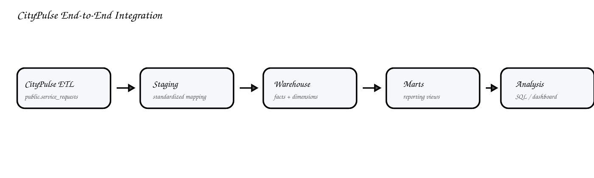
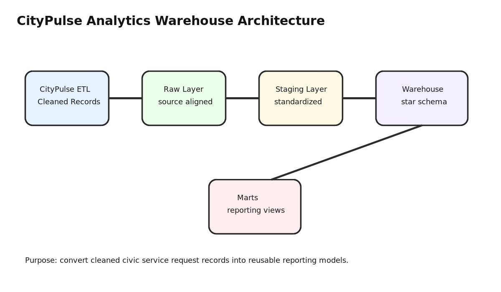

# CityPulse Analytics Warehouse

CityPulse Analytics Warehouse is the downstream dimensional warehouse for the **CityPulse ETL** pipeline. The ETL project ingests and validates municipal service request records into PostgreSQL; this warehouse reads that cleaned table, builds a star schema, and creates reporting marts for civic operations analysis.

This project is designed as a serious graduating-student analytics engineering portfolio piece. It focuses on a realistic workflow: **raw civic data → cleaned ETL output → staging layer → dimensional warehouse → reporting marts → SQL analysis**.

---

## How This Interfaces with CityPulse ETL

The integration point is the table produced by the CityPulse ETL project:

```text
public.service_requests
```

The warehouse build imports that table into its own staging schema:

```text
public.service_requests
        ↓
staging.service_requests
        ↓
warehouse.dim_date
warehouse.dim_location
warehouse.dim_request_type
warehouse.dim_status
warehouse.fact_service_requests
        ↓
marts.* reporting views
```

That means this repo is not just a separate SQL demo. It is written as the analytics layer that runs **after** the CityPulse ETL pipeline finishes loading cleaned records into PostgreSQL.

---

## Visual Overview

### End-to-End Integration


### Warehouse Architecture


### Star Schema


### Reporting Flow


---

## What the Warehouse Adds

CityPulse ETL focuses on row-level cleaning and loading. This warehouse adds the analytics layer:

- staging schema that standardizes the ETL output
- date, location, request type, and status dimensions
- fact table with one row per service request
- reusable mart views for reporting
- data quality checks across staging and warehouse layers
- example SQL queries for business-style analysis

---

## Data Model

**Fact table**

- `warehouse.fact_service_requests`

**Dimensions**

- `warehouse.dim_date`
- `warehouse.dim_location`
- `warehouse.dim_request_type`
- `warehouse.dim_status`

**Reporting marts**

- `marts.monthly_service_volume`
- `marts.category_workload`
- `marts.borough_performance`
- `marts.resolution_time_analysis`
- `marts.operational_kpi_summary`

---

## Quick Start

### 1. Start PostgreSQL

If you are using this repo by itself:

```bash
docker compose up -d
```

If you are running it alongside the CityPulse ETL repo, use the same PostgreSQL container/database used by CityPulse ETL.

### 2. Run CityPulse ETL first

From the CityPulse ETL repo:

```bash
python scripts/run_pipeline.py
```

This should create or refresh:

```text
public.service_requests
```

### 3. Build the warehouse from CityPulse ETL output

From this repo:

```bash
psql -h localhost -U citypulse_user -d citypulse_warehouse -f sql/run_citypulse_integrated_build.sql
```

### 4. Run quality checks

```bash
psql -h localhost -U citypulse_user -d citypulse_warehouse -f sql/quality/data_quality_checks.sql
```

### 5. Run example analysis queries

```bash
psql -h localhost -U citypulse_user -d citypulse_warehouse -f sql/analytics/example_service_queries.sql
```

---

## Optional Standalone Demo

If `public.service_requests` does not exist yet, run:

```bash
psql -h localhost -U citypulse_user -d citypulse_warehouse -f scripts/load_sample_raw.sql
psql -h localhost -U citypulse_user -d citypulse_warehouse -f sql/run_warehouse_build.sql
```

The standalone script exists so the warehouse can still be reviewed independently, but the main intended path is the integrated CityPulse ETL build.

---

## Repository Structure

```text
CityPulse-Analytics-Warehouse/
├── assets/                     # README diagrams and visuals
├── docs/                       # walkthroughs and interview explanation notes
├── scripts/                    # sample loading and helper scripts
├── sql/
│   ├── integration/            # reads from CityPulse ETL public.service_requests
│   ├── raw/                    # standalone sample landing tables
│   ├── staging/                # standardized staging schema
│   ├── warehouse/              # dimensions and fact table build scripts
│   ├── marts/                  # reporting views
│   ├── quality/                # validation checks
│   └── analytics/              # example analysis queries
├── docker-compose.yml
└── README.md
```

---

## Key Engineering Concepts Demonstrated

- PostgreSQL schema design
- pipeline integration across two related projects
- staged transformation architecture
- star-schema dimensional modeling
- fact and dimension table construction
- SQL reporting marts
- data quality checks
- reproducible local database setup with Docker
- interview-friendly documentation

---

## Design Decisions

This project avoids unnecessary enterprise claims and focuses on fundamentals that are explainable in an interview. The warehouse is intentionally batch-oriented, uses readable SQL, and keeps transformations transparent so each layer can be defended clearly.

The goal is to show that I understand how cleaned operational data becomes a structured analytics model, not just how to write isolated SQL queries.

---

## Limitations

- The project assumes CityPulse ETL has loaded `public.service_requests` first.
- The current warehouse uses full-refresh SQL builds instead of incremental loading.
- The dataset is portfolio-scale, not production-scale.
- Future versions could add dbt, Airflow, SCD Type 2 dimensions, and incremental fact loading.

---

## Future Improvements

- Convert SQL scripts into dbt models
- Add incremental fact loading
- Add slowly changing dimensions
- Add dashboard integration with Streamlit or Power BI
- Add GitHub Actions for SQL linting

---

## Author

**Zachary Amachee**  
CIS @ Baruch College  
Analytics Engineering • Data Engineering • Business Intelligence
